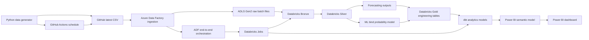
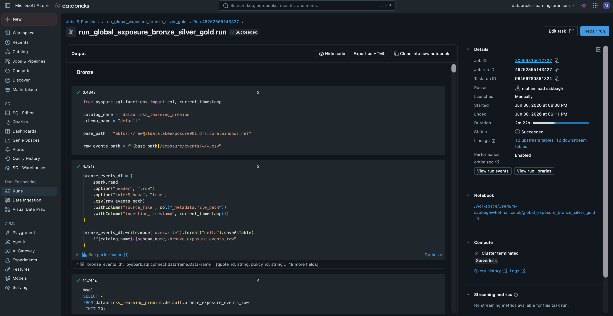
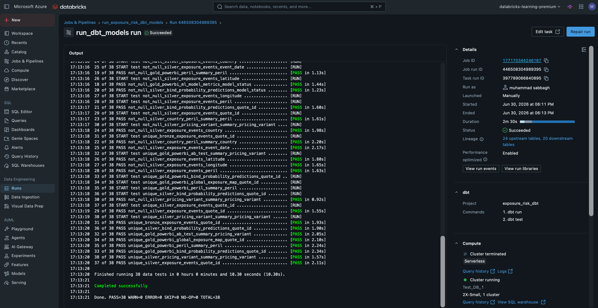
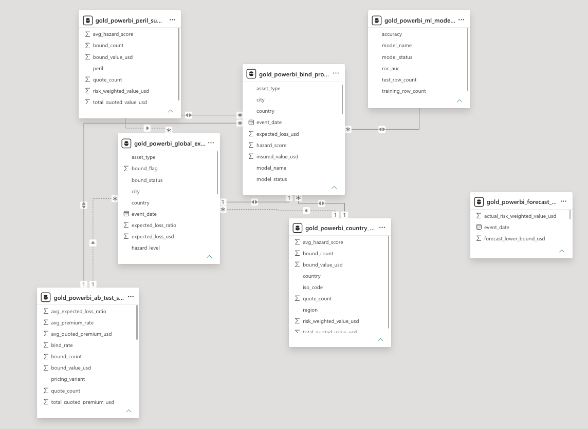

# Global Exposure & Peril Risk Analytics Project

## End-to-end Azure data engineering, analytics engineering, machine learning and Power BI portfolio project

This project simulates a global insurance exposure portfolio and builds a full end-to-end data pipeline around it.

Instead of using a static CSV, the project uses a Python generator that creates new artificial quote and exposure records over time. Azure Data Factory ingests the latest generated batch into Azure Data Lake Storage Gen2, Databricks processes the raw files through a Bronze/Silver/Gold medallion architecture, dbt creates Power BI-ready analytics models, and Power BI visualises global exposure, peril risk, A/B pricing performance, forecasting trends and machine learning bind probability predictions.

---

## Project outcome

The final project demonstrates a complete modern data workflow:

```text
Python data generator
→ GitHub latest CSV
→ GitHub Actions scheduled generation
→ Azure Data Factory ingestion
→ Azure Data Lake Storage Gen2 raw storage
→ Databricks Bronze/Silver/Gold engineering tables
→ Databricks Jobs
→ dbt analytics models and tests
→ Power BI semantic model
→ Power BI dashboard
→ ADF end-to-end orchestration
```

---

## Business scenario

The project is based on a simplified insurance analytics use case.

A global insurer receives quote and exposure records across different countries, assets and natural catastrophe perils. The business wants to understand:

- where exposure is concentrated globally
- which countries and perils carry the most risk
- how pricing variants A and B are performing
- how risk-weighted exposure is trending over time
- what the next 90 days of risk-weighted exposure could look like
- which quotes are most likely to bind

Each generated record includes:

- quote and policy identifiers
- event date and generated timestamp
- country, region, city, latitude and longitude
- asset type
- peril
- hazard score
- insured value
- pricing variant A/B
- quoted premium
- expected loss
- bind outcome

---

## Skills demonstrated

| Area | What this project demonstrates |
|---|---|
| Python | Data generation, file handling, environment variables, state tracking |
| Pandas | Data cleaning, type conversion, deduplication and feature creation |
| Azure Data Factory | HTTP ingestion, ADLS sink configuration and orchestration |
| ADLS Gen2 | Raw data lake storage with timestamped batch files |
| Databricks | Notebook-based transformations, Delta tables, Unity Catalog and Jobs |
| PySpark | Reading raw files from ADLS and creating Bronze tables |
| SQL | Gold engineering tables and reporting outputs |
| Machine learning | scikit-learn logistic regression bind probability model |
| dbt | Analytics modelling, model layering and tests |
| Power BI | Semantic model, DAX measures, dashboards and business reporting |
| Orchestration | ADF pipeline triggering Databricks engineering and dbt jobs |
| GitHub | Public portfolio repo, screenshots, documentation and automation |

---

## Final architecture



---

# Project evidence and screenshots

The screenshots below show the project from data generation through to final reporting.

---

## 1. GitHub repository structure

The repo is organised so an employer can quickly understand the project code, documentation, screenshots, dbt models, Databricks assets and ADF assets.


**What this shows**

The repository is structured like a real portfolio project rather than a loose collection of files. The code, documentation, screenshots, dbt project, Databricks assets and ADF assets are separated clearly so someone reviewing the repo can understand the project quickly.

---

## 2. Python data generator

The project starts with a Python script that generates artificial insurance quote and exposure records.

The generator writes:

```text
source_data/latest/exposure_events_latest.csv
source_data/master/exposure_events_all.csv
source_data/state/generator_state.json
```

The latest file is used by ADF. The master file keeps a local generated history. The state file tracks run numbers and total rows generated so quote IDs do not restart.

The generator can run in normal daily mode:

```bash
python scripts/generate_daily_exposure_events.py
```

It can also create a historical seed dataset for forecasting and ML training:

```bash
HISTORICAL_SEED_MODE=true BATCH_SIZE=1000 HISTORICAL_SEED_DAYS=90 python scripts/generate_daily_exposure_events.py
```


**What this shows**

This proves the project is not based on a one-off static CSV. The data source is generated and can evolve over time. The script also supports a historical seed mode, which gives the forecast and machine learning model enough historical data to work with.

---

## 3. GitHub Actions automation

GitHub Actions can run the generator on a schedule and commit the newly generated data files back into the repo.

This creates a simple automated data source pattern:

```text
GitHub Actions
→ Python generator
→ updated latest CSV
→ ADF ingestion
```


**What this shows**

This shows that the artificial source data can refresh automatically. In a real business environment, this pattern could be replaced with a real API, SFTP feed, event stream or operational database extract.

---

## 4. Azure Data Factory raw ingestion

ADF copies the latest generated CSV from GitHub into ADLS Gen2.

The raw sink path is dynamic, so each pipeline run creates a new raw file instead of overwriting the previous file:

```text
raw/exposure/events/ingestion_date=YYYY-MM-DD/exposure_events_YYYYMMDD_HHMMSS.csv
```


**What this shows**

This screenshot proves that Azure Data Factory is used as the ingestion tool. It moves data from the GitHub raw CSV source into the data lake and creates the first stage of the cloud pipeline.

---

## 5. ADLS Gen2 raw data lake structure

ADLS stores every ingested raw batch historically.

Example structure:

```text
raw/
└── exposure/
    └── events/
        ├── ingestion_date=2026-06-28/
        ├── ingestion_date=2026-06-29/
        └── ingestion_date=2026-06-30/
```

This proves that the project is using a proper raw landing pattern rather than simply overwriting one file.


**What this shows**

This is the raw data lake evidence. Every run lands as a separate timestamped batch, which means the raw layer keeps history and can be reprocessed if needed.

---

## 6. Databricks engineering notebook

Databricks reads all raw files from ADLS and builds the core engineering layer.

The engineering notebook creates:

- Bronze raw exposure events
- Silver cleaned exposure events
- Silver daily exposure summary
- Silver A/B pricing summary
- Silver risk forecast
- Silver ML bind probability predictions
- Silver ML model metrics
- Gold engineering tables for dbt and Power BI


**What this shows**

This screenshot proves the transformation layer is built in Databricks. It demonstrates the practical engineering work behind the project: reading raw files, cleaning data, applying business logic, creating medallion tables and preparing outputs for dbt and Power BI.

---

## 7. Databricks medallion tables

The Databricks tables follow a medallion-style architecture.

| Layer | Purpose |
|---|---|
| Bronze | Raw structured data from ADLS |
| Silver | Cleaned, typed and enriched business data |
| Gold | Reporting-ready engineering tables |

Example outputs include:

- `bronze_exposure_events_raw`
- `silver_exposure_events_cleaned`
- `silver_daily_exposure_summary`
- `silver_ab_pricing_summary`
- `silver_risk_forecast`
- `silver_bind_probability_predictions`
- `silver_ml_model_metrics`
- `gold_exposure_events_engineering`
- `gold_daily_forecast_engineering`
- `gold_ab_pricing_engineering`
- `gold_bind_probability_predictions_engineering`
- `gold_ml_model_metrics_engineering`


**What this shows**

This proves the notebook produces persistent Databricks tables, not just temporary notebook outputs. It also shows the project has a clear Bronze, Silver and Gold structure.

---

## 8. Databricks engineering job

The engineering notebook is configured as a Databricks Job so it can be triggered by ADF.

This means the notebook is not just manually run once. It is operationalised as part of the pipeline.



**What this shows**

This proves the Databricks engineering work is reusable and schedulable. ADF can call this job as part of the wider orchestration process.

---

## 9. Machine learning bind probability model

The project includes a simple supervised machine learning model to predict whether a quote is likely to bind.

Model type:

```text
Logistic Regression
```

Target:

```text
bound_flag
```

Example features:

- country
- region
- city
- asset type
- peril
- pricing variant
- hazard score
- insured value
- quoted premium
- expected loss
- risk-weighted value
- premium rate
- expected loss ratio

Model outputs:

- `predicted_bind_probability`
- `predicted_bound_flag`
- accuracy
- ROC AUC
- training row count
- test row count

The goal of the ML section is not to create a perfect production model. It is to demonstrate that the pipeline can prepare features, train a model, score predictions and publish outputs for reporting.

---

## 10. dbt analytics models and tests

On top of the Databricks Gold engineering tables, dbt creates analytics-ready models for Power BI.

Final dbt Gold models include:

- `gold_powerbi_global_exposure_map`
- `gold_powerbi_country_summary`
- `gold_powerbi_peril_summary`
- `gold_powerbi_forecast_daily_risk`
- `gold_powerbi_ab_test_summary`
- `gold_powerbi_bind_probability_predictions`
- `gold_powerbi_ml_model_metrics`

The dbt project also includes tests for important fields such as quote ID, event date, country, city, peril, latitude, longitude, pricing variant and predicted bind probability.


**What this shows**

This screenshot proves the analytics layer is modelled properly. dbt separates raw engineering outputs from BI-ready reporting tables and adds tests so key fields can be validated.

---

## 11. Databricks dbt job

The dbt models are also configured as a Databricks Job.

This allows ADF to trigger dbt as part of the same end-to-end orchestration process.



**What this shows**

This proves dbt is not only being run locally. It has been operationalised so the analytics models can be rebuilt as part of the pipeline.

---

## 12. ADF end-to-end orchestration

The final ADF orchestration pipeline runs the full process in sequence:

```text
raw ingestion pipeline
→ Databricks engineering job
→ Databricks dbt job
```

This demonstrates orchestration of the complete workflow rather than separate manual steps.


**What this shows**

This is the end-to-end pipeline evidence. ADF controls the full workflow from ingestion through transformation and analytics modelling.

---

# Power BI reporting layer

The Power BI report is built from the dbt Gold models. It includes a semantic model and five main dashboard pages.

The dashboard story is:

```text
1. Start with total global exposure and where the portfolio is concentrated.
2. Break the portfolio down by peril and country.
3. Understand how risk-weighted exposure is trending and forecasted to move.
4. Compare pricing variants A and B.
5. Use ML predictions to identify commercial bind potential.
```

---

## 13. Power BI semantic model

The semantic model uses the dbt Gold reporting tables as the reporting layer.

The model includes separate tables for:

- global exposure mapping
- country summary
- peril summary
- forecasting
- A/B pricing analysis
- ML bind probability predictions
- ML model metrics

This shows that the report is not built from raw data directly. It is built from clean, modelled reporting tables.



**Semantic model narrative**

The semantic model is the bridge between dbt and the dashboard. The report uses dedicated Gold tables for each analytical area rather than forcing every visual to query raw event-level data. This makes the dashboard easier to maintain and easier to explain.

The model supports separate reporting questions:

- the map uses event-level exposure and location fields
- the country and peril visuals use summary tables
- the forecast page uses an actual/forecast daily risk table
- the A/B page uses pricing variant summary outputs
- the ML page uses prediction and model metric tables

---

## 14. Global Exposure Overview dashboard


**Dashboard narrative**

This page is the executive overview of the portfolio. It answers the first question an insurance stakeholder would ask: **where is the exposure and how large is it?**

The dashboard shows a total quoted value of around **200.02bn** and roughly **3K bound quotes**. The map places exposure globally using latitude and longitude, with risk category shown visually on the map. This helps the user quickly understand that the portfolio is spread across multiple global regions rather than concentrated in one market.

The bar chart ranks countries by risk-weighted value. In this view, countries such as Australia, India, the United States, Japan and Mexico are among the largest contributors to risk-weighted exposure. This gives the user a fast way to identify where portfolio risk is most concentrated.

The slicers allow the user to filter by country and peril. This means the dashboard can move from a global overview to a more focused investigation, such as looking only at Flood exposure or only at a specific country.

**What this page shows**

- total quoted exposure across the portfolio
- bound quote volume
- global geographic spread of exposure
- risk category distribution by location
- country ranking by risk-weighted value
- interactive filtering by country and peril

**Business takeaway**

The portfolio is globally diversified, but risk-weighted exposure is not evenly distributed. Some countries contribute materially more to the total risk profile, making them natural areas for deeper underwriting and exposure management review.

---

## 15. Peril Risk Analysis dashboard


**Dashboard narrative**

This page moves from the geographic view into the peril view. It answers: **which catastrophe perils are driving the most risk, and how does that vary by country?**

The matrix at the top breaks risk-weighted value down by country and peril, with a peril percentage showing each peril's share within a country. This is useful because two countries can have similar total exposure but very different peril mixes.

The lower-left chart ranks perils by total risk-weighted value. Flood is the largest peril in this view at roughly **22bn**, followed by Drought at around **21bn**, then Earthquake, Cyclone and Wildfire. The lower-right chart shows average hazard score by peril. Flood also has the highest average hazard score, around **2.8**, followed by Drought and Earthquake.

Together, the two charts show both exposure size and hazard severity. A peril with high exposure and high hazard score is more important than a peril that is high on only one of those dimensions.

**What this page shows**

- risk-weighted value by peril
- average hazard score by peril
- country/peril matrix
- each peril's percentage contribution within countries
- peril and country filtering

**Business takeaway**

Flood appears to be the most important peril in this portfolio because it has both the highest risk-weighted value and the highest average hazard score. This would be a priority area for underwriting review, accumulation monitoring and pricing adequacy checks.

---

## 16. Forecasting Trend dashboard


**Dashboard narrative**

This page looks at how portfolio risk-weighted exposure is moving over time. It answers: **based on the historical generated portfolio, what could the next 90 days look like?**

The line chart compares actual daily risk-weighted exposure against a 7-day rolling average and a simple forecast. The actual daily values are volatile, which is expected because the generated data produces daily batches with different locations, perils and insured values. The rolling average smooths that volatility and gives a cleaner sense of the underlying trend.

The forecast line extends beyond the latest actual date into the future. In this screenshot, the latest actual risk-weighted exposure is around **121.40M**, the forecast end value is around **158.92M**, and the forecast change is around **30.91%**. The upward forecast suggests that, based on this simple trend logic, risk-weighted exposure could increase over the forecast horizon.

This forecast is deliberately simple and explainable. It is not the machine learning model. The ML model predicts quote bind probability; this forecast estimates future risk-weighted exposure.

**What this page shows**

- actual daily risk-weighted exposure
- 7-day rolling average
- 90-day forecast
- latest actual value
- forecast end value
- forecast percentage change
- detailed actual and forecast values in a table

**Business takeaway**

The portfolio shows daily volatility, but the simple trend-based forecast indicates a potential increase in risk-weighted exposure. A stakeholder could use this view to monitor whether exposure is trending upward and whether underwriting appetite or capacity controls need review.

---

## 17. A/B Pricing Analysis dashboard


**Dashboard narrative**

This page compares pricing variants A and B. It answers: **does the discounted pricing variant appear to improve commercial conversion?**

The dashboard shows around **7K total quotes** and an overall bind rate of around **46.74%**. Variant B has a higher bind rate than Variant A in this view: B is around **50.03%**, while A is around **43.35%**. The KPI card shows a B bind rate uplift of around **6.68%**.

The premium comparison shows that Variant B has a lower average quoted premium than Variant A. The dashboard also shows a negative B average premium difference of around **($10.61K)**, which means B is cheaper on average. Despite that lower premium, Variant B produces more bound value in this generated dataset, with around **$51.36bn** bound value compared with around **$43.03bn** for Variant A.

The key commercial narrative is that Variant B appears to trade lower average premium for higher conversion and more bound value.

Important note: the A and B bind rates are separate conversion rates. They do **not** need to add up to 100%.

**What this page shows**

- total quote volume
- overall bind rate
- total bound value
- average expected loss ratio
- bind rate by pricing variant
- average quoted premium by pricing variant
- bound value by pricing variant
- pricing variant summary table

**Business takeaway**

In this generated portfolio, Variant B appears commercially stronger because it has a higher bind rate and higher bound value, even though its average quoted premium is lower. This is the kind of trade-off pricing and underwriting teams often need to analyse.

---

## 18. ML Bind Probability dashboard


**Dashboard narrative**

This page surfaces the machine learning outputs in a business-friendly way. It answers: **which parts of the portfolio have stronger or weaker predicted commercial bind potential?**

The dashboard shows an average predicted bind probability of around **46.78%** and an actual bind rate of around **46.7%**. The model was trained on around **5K rows** and tested on around **2K rows**. The model accuracy is around **54.90%** and ROC AUC is around **0.55**.

Those model metrics are intentionally shown because they keep the analysis honest. The model is not presented as a highly accurate production model. Instead, it demonstrates the full machine learning workflow: feature preparation, train/test split, logistic regression modelling, prediction scoring, metric calculation and publishing predictions into Power BI.

The pricing variant chart shows Variant B has a higher average predicted bind probability than Variant A, which supports the A/B dashboard narrative. The peril chart shows predicted bind probability by peril, with some perils clustering around 0.5 and Drought lower in this view. The country chart breaks commercial bind potential into relative bands, showing where high, medium and low potential opportunities sit geographically.

The donut chart summarises quoted value by commercial bind band. In this screenshot, high commercial bind potential represents around **$72bn**, medium around **$69bn**, and low around **$59bn**. The table at the bottom allows users to inspect individual quotes, including quote ID, country, city, peril, pricing variant, insured value, quoted premium, actual bound flag and predicted bind probability.

**What this page shows**

- average predicted bind probability
- predicted bind rate
- actual bind rate
- model accuracy
- ROC AUC
- training and test row counts
- predicted bind probability by pricing variant
- predicted bind probability by peril
- commercial bind band by country
- quoted value by commercial bind band
- quote-level prediction table

**Business takeaway**

The ML model is useful as a prioritisation layer rather than a perfect predictor. It helps identify which quotes or segments may have stronger commercial bind potential and which high-value opportunities may need extra underwriting or broker engagement.

---

# Power BI measures and modelling

The report includes DAX measures for core KPIs.

## Total Quoted Value

```DAX
Total Quoted Value =
SUM(gold_powerbi_global_exposure_map[insured_value_usd])
```

## Total Risk-Weighted Value

```DAX
Total Risk-Weighted Value =
SUM(gold_powerbi_global_exposure_map[risk_weighted_value_usd])
```

## Quote Count

```DAX
Quote Count =
DISTINCTCOUNT(gold_powerbi_global_exposure_map[quote_id])
```

## Bound Quote Count

```DAX
Bound Quote Count =
SUM(gold_powerbi_global_exposure_map[bound_flag])
```

## Overall Bind Rate

```DAX
Overall Bind Rate =
DIVIDE(
    [Bound Quote Count],
    [Quote Count]
)
```

## Average Predicted Bind Probability

```DAX
Average Predicted Bind Probability =
AVERAGE(gold_powerbi_bind_probability_predictions[predicted_bind_probability])
```

The Power BI model also uses a calculated column for relative commercial bind banding.

```DAX
Relative Commercial Bind Band =
VAR CurrentProbability =
    gold_powerbi_bind_probability_predictions[predicted_bind_probability]

VAR HighThreshold =
    PERCENTILEX.INC(
        ALL(gold_powerbi_bind_probability_predictions),
        gold_powerbi_bind_probability_predictions[predicted_bind_probability],
        0.67
    )

VAR MediumThreshold =
    PERCENTILEX.INC(
        ALL(gold_powerbi_bind_probability_predictions),
        gold_powerbi_bind_probability_predictions[predicted_bind_probability],
        0.33
    )

RETURN
SWITCH(
    TRUE(),
    CurrentProbability >= HighThreshold, "High commercial bind potential",
    CurrentProbability >= MediumThreshold, "Medium commercial bind potential",
    "Low commercial bind potential"
)
```

---

# Repository structure

```text
global_exposure_risk_project/
│
├── README.md
├── requirements.txt
├── .gitignore
│
├── scripts/
│   └── generate_daily_exposure_events.py
│
├── source_data/
│   ├── latest/
│   │   └── exposure_events_latest.csv
│   ├── master/
│   │   └── exposure_events_all.csv
│   └── state/
│       └── generator_state.json
│
├── exposure_risk_dbt/
│   ├── dbt_project.yml
│   └── models/
│       ├── bronze_exposure_events.sql
│       ├── bronze_daily_forecast.sql
│       ├── bronze_ab_pricing.sql
│       ├── bronze_bind_probability_predictions.sql
│       ├── bronze_ml_model_metrics.sql
│       ├── silver_country_peril_summary.sql
│       ├── silver_daily_exposure_summary.sql
│       ├── silver_pricing_variant_summary.sql
│       ├── silver_bind_probability_summary.sql
│       ├── gold_powerbi_global_exposure_map.sql
│       ├── gold_powerbi_country_summary.sql
│       ├── gold_powerbi_peril_summary.sql
│       ├── gold_powerbi_forecast_daily_risk.sql
│       ├── gold_powerbi_ab_test_summary.sql
│       ├── gold_powerbi_bind_probability_predictions.sql
│       ├── gold_powerbi_ml_model_metrics.sql
│       └── schema.yml
│
├── databricks/
│   └── global_exposure_bronze_silver_gold.ipynb
│
├── adf/
│   ├── pl_ingest_exposure_events_daily_raw.json
│   └── pl_daily_exposure_risk_end_to_end.json
│
├── docs/
│   ├── project_walkthrough.md
│   ├── screenshot_plan.md
│   └── dax_measures.md
│
└── screenshots/
    ├── 01_repo_structure.png
    ├── 02_python_generator.png
    ├── 03_github_actions.png
    ├── 04_adf_ingestion_pipeline.png
    ├── 05_adls_raw_structure.png
    ├── 06_databricks_notebook.png
    ├── 07_databricks_tables.png
    ├── 08_dbt_models.png
    ├── 09_adf_end_to_end_pipeline.png
    ├── 10_powerbi_global_overview.png
    ├── 11_powerbi_peril_analysis.png
    ├── 12_powerbi_forecast.png
    ├── 13_powerbi_ab_pricing.png
    ├── 14_powerbi_ml_bind_probability.png
    ├── 15_databricks_engineering_job.png
    ├── 16_databricks_dbt_job.png
    └── 17_powerbi_semantic_model.png
```

---

# How to run the project

## 1. Generate data locally

```bash
python scripts/generate_daily_exposure_events.py
```

## 2. Create a historical seed dataset

```bash
HISTORICAL_SEED_MODE=true BATCH_SIZE=1000 HISTORICAL_SEED_DAYS=90 python scripts/generate_daily_exposure_events.py
```

## 3. Push generated data to GitHub

```bash
git add .
git commit -m "Generate exposure events"
git push
```

## 4. Run the ADF end-to-end pipeline

Run:

```text
pl_daily_exposure_risk_end_to_end
```

This triggers:

```text
raw ingestion
→ Databricks engineering job
→ Databricks dbt job
```

## 5. Refresh Power BI

Refresh the Power BI dataset/report connected to the dbt Gold models.

---

# Key technical decisions

## Why generated data?

A static CSV would make the project feel like a one-off dashboard. The generator makes the dataset evolve over time and supports a more realistic ingestion pattern.

## Why timestamped raw files?

Each ADF run lands a new raw file. This means the raw data lake keeps history instead of overwriting the same file.

## Why Databricks?

Databricks handles the engineering pipeline, Spark-based raw reads, Pandas cleaning logic, SQL Gold table creation and machine learning outputs.

## Why dbt?

dbt creates a clean analytics layer on top of Databricks Gold engineering tables. It also adds tests and makes the Power BI models easier to understand and maintain.

## Why Power BI semantic modelling?

The report is built from modelled dbt Gold tables rather than raw data. This makes the reporting layer cleaner and easier to explain.

## Why simple forecasting?

The forecast is deliberately simple and explainable. It demonstrates forecasting-style analytics without pretending to be a production-grade forecasting system.

## Why logistic regression?

The ML model is intentionally simple and portfolio-friendly. It demonstrates feature preparation, train/test split, prediction, model scoring and publishing ML outputs to Power BI.

---

# Project Summary

I built an end-to-end Azure data engineering project that simulates an evolving global insurance exposure portfolio.

The project starts with a Python generator that creates artificial quote and exposure records. GitHub Actions can run the generator on a schedule, and Azure Data Factory ingests the latest generated CSV from GitHub into Azure Data Lake Storage Gen2. Each ADF run lands as a separate timestamped raw batch file, preserving the raw history.

Databricks reads the raw files and processes them through Bronze, Silver and Gold layers. The Silver layer uses Python, Pandas and PySpark-style processing to clean the data, deduplicate quote records, create risk categories, calculate risk-weighted exposure, build A/B pricing summaries, generate a 90-day forecast and train a logistic regression model to predict quote bind probability.

The Databricks Gold tables are then used by dbt to create tested, Power BI-ready analytics models. The final Power BI report includes a semantic model and dashboards for global exposure mapping, peril risk analysis, forecasting, A/B pricing performance and ML bind probability insights.

The dashboard narrative is that the portfolio has broad global exposure, Flood is the strongest risk driver in the generated data, the simple forecast suggests risk-weighted exposure may rise over the next 90 days, Variant B appears to improve bind performance despite a lower average premium, and the ML layer provides a commercial prioritisation view of quote bind potential.

The full workflow is orchestrated through Azure Data Factory, which triggers raw ingestion, the Databricks engineering job and the Databricks dbt job in sequence.

---