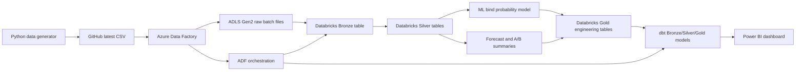

# Global Exposure & Peril Risk Analytics Project

## End-to-end Azure data engineering + analytics portfolio project

This project simulates a global insurance exposure portfolio and builds a full data pipeline around it.

Instead of using a static CSV, the project uses a Python data generator that creates new artificial quote/exposure records over time. Azure Data Factory ingests the latest generated batch into Azure Data Lake Storage Gen2, Databricks processes the raw files through a Bronze/Silver/Gold medallion architecture, dbt creates Power BI-ready analytics models, and Power BI visualises global exposure, peril risk, A/B pricing performance, forecasting trends, and machine learning bind probability predictions.

---

## Project summary

| Area | What this project demonstrates |
|---|---|
| Data generation | Python-generated evolving insurance exposure dataset |
| Ingestion | Azure Data Factory copying GitHub raw CSV data into ADLS Gen2 |
| Data lake | Timestamped raw batch files stored historically in ADLS |
| Transformation | Databricks notebook using PySpark, Pandas and SQL |
| Architecture | Bronze, Silver and Gold medallion layers |
| Analytics engineering | dbt models and tests on top of Databricks tables |
| Machine learning | scikit-learn logistic regression bind probability model |
| BI reporting | Power BI dashboards with DAX measures and calculated columns |
| Orchestration | ADF end-to-end pipeline triggering ingestion, Databricks and dbt |

---

## Business problem

The project models a simplified insurance analytics scenario:

> A global insurer receives quote and exposure records across different countries, assets and natural catastrophe perils. The business wants to understand where exposure is concentrated, which perils drive the most risk, how pricing variants perform, how risk-weighted exposure is trending, and which quotes are most likely to bind.

Each generated record includes:

- quote and policy identifiers
- event date
- country, region, city, latitude and longitude
- asset type
- peril
- hazard score
- insured value
- pricing variant A/B
- quoted premium
- expected loss
- bind outcome

---

## Final architecture



---

## Screenshots

Add screenshots into the `screenshots/` folder using the filenames below.

| Screenshot | What it should show |
|---|---|
| `01_repo_structure.png` | GitHub repo folders and key project files |
| `02_python_generator.png` | Python generator script in VS Code |
| `03_github_actions.png` | Optional GitHub Actions workflow for daily data generation |
| `04_adf_ingestion_pipeline.png` | ADF raw ingestion pipeline |
| `05_adls_raw_structure.png` | ADLS raw folder with dated/timestamped batch files |
| `06_databricks_notebook.png` | Databricks notebook creating Bronze/Silver/Gold tables |
| `07_databricks_tables.png` | Unity Catalog tables showing Bronze, Silver and Gold outputs |
| `08_dbt_models.png` | dbt model folder or dbt run/test output |
| `09_adf_end_to_end_pipeline.png` | Final ADF orchestration pipeline |
| `10_powerbi_global_overview.png` | Power BI Global Exposure Overview page |
| `11_powerbi_peril_analysis.png` | Power BI Peril Risk Analysis page |
| `12_powerbi_forecast.png` | Power BI Forecasting Trend page |
| `13_powerbi_ab_pricing.png` | Power BI A/B Pricing Analysis page |
| `14_powerbi_ml_bind_probability.png` | Power BI ML Bind Probability page |

### Example dashboard screenshots

#### Global Exposure Overview


#### Forecasting Trend


#### ML Bind Probability


---

## Repository structure

```text
global_exposure_risk_project/
│
├── README.md
│
├── scripts/
│   └── generate_daily_exposure_events.py
│
├── source_data/
│   ├── latest/
│   │   └── exposure_events_latest.csv
│   ├── master/
│   │   └── exposure_events_all.csv
│   └── state/
│       └── generator_state.json
│
├── exposure_risk_dbt/
│   ├── dbt_project.yml
│   └── models/
│       ├── bronze_exposure_events.sql
│       ├── bronze_daily_forecast.sql
│       ├── bronze_ab_pricing.sql
│       ├── bronze_bind_probability_predictions.sql
│       ├── bronze_ml_model_metrics.sql
│       ├── silver_country_peril_summary.sql
│       ├── silver_daily_exposure_summary.sql
│       ├── silver_pricing_variant_summary.sql
│       ├── silver_bind_probability_summary.sql
│       ├── gold_powerbi_global_exposure_map.sql
│       ├── gold_powerbi_country_summary.sql
│       ├── gold_powerbi_peril_summary.sql
│       ├── gold_powerbi_forecast_daily_risk.sql
│       ├── gold_powerbi_ab_test_summary.sql
│       ├── gold_powerbi_bind_probability_predictions.sql
│       ├── gold_powerbi_ml_model_metrics.sql
│       └── schema.yml
│
├── databricks/
│   └── global_exposure_bronze_silver_gold.ipynb
│
├── adf/
│   ├── pl_ingest_exposure_events_daily_raw.json
│   └── pl_daily_exposure_risk_end_to_end.json
│
├── docs/
│   ├── project_walkthrough.md
│   ├── screenshot_plan.md
│   └── dax_measures.md
│
└── screenshots/
```

---

## Main pipeline stages

### 1. Python data generator

The generator creates artificial quote and exposure events.

Key features:

- creates 5 new rows by default
- supports a larger backfill seed dataset
- spreads seed data across historical dates for trend analysis
- stores the newest batch in `source_data/latest/`
- stores all generated rows in `source_data/master/`
- tracks run state in `source_data/state/`

Example commands:

```bash
python scripts/generate_daily_exposure_events.py
```

Initial seed dataset:

```bash
BATCH_SIZE=1000 BACKFILL_DAYS=90 python scripts/generate_daily_exposure_events.py
```

---

### 2. Azure Data Factory ingestion

ADF reads the latest generated CSV from GitHub and writes it into ADLS Gen2 as a timestamped raw batch file.

Example sink pattern:

```text
raw/exposure/events/ingestion_date=YYYY-MM-DD/exposure_events_YYYYMMDD_HHMMSS.csv
```

This means the lake keeps historical raw batches rather than overwriting the same file.

---

### 3. ADLS Gen2 raw storage

The raw layer stores every ingested batch.

Example:

```text
raw/
└── exposure/
    └── events/
        ├── ingestion_date=2026-06-28/
        ├── ingestion_date=2026-06-29/
        └── ingestion_date=2026-06-30/
```

---

### 4. Databricks medallion processing

Databricks reads all raw files and creates:

| Layer | Purpose |
|---|---|
| Bronze | Raw structured exposure events from ADLS |
| Silver | Cleaned data, typed fields, deduplication, business calculations |
| Gold | Reporting-ready engineering tables for dbt and Power BI |

Silver includes:

- cleaned exposure events
- daily exposure summary
- A/B pricing summary
- 90-day risk-weighted exposure forecast
- ML bind probability predictions
- ML model metrics

---

### 5. Machine learning

The model predicts quote bind probability.

Model:

```text
Logistic Regression
```

Target:

```text
bound_flag
```

Features include:

- country
- region
- asset type
- peril
- pricing variant
- hazard score
- insured value
- quoted premium
- expected loss
- risk-weighted value
- premium rate
- expected loss ratio

Outputs:

- `predicted_bind_probability`
- `predicted_bound_flag`
- model accuracy
- ROC AUC
- training row count
- test row count

---

### 6. dbt analytics models

dbt creates Power BI-ready models from the Databricks Gold engineering tables.

Final dbt Gold models include:

- `gold_powerbi_global_exposure_map`
- `gold_powerbi_country_summary`
- `gold_powerbi_peril_summary`
- `gold_powerbi_forecast_daily_risk`
- `gold_powerbi_ab_test_summary`
- `gold_powerbi_bind_probability_predictions`
- `gold_powerbi_ml_model_metrics`

dbt tests check important fields such as:

- quote ID
- event date
- country
- city
- peril
- latitude
- longitude
- pricing variant
- predicted bind probability

---

### 7. Power BI reporting

The Power BI report contains five main pages:

| Page | Purpose |
|---|---|
| Global Exposure Overview | Map and portfolio exposure KPIs |
| Peril Risk Analysis | Risk by peril, country and hazard level |
| Forecasting Trend | Actual vs 90-day forecasted risk-weighted exposure |
| A/B Pricing Analysis | Pricing variant performance comparison |
| ML Bind Probability | Predicted bind probability and model performance |

---

## Key DAX measures

```DAX
Total Quoted Value =
SUM(gold_powerbi_global_exposure_map[insured_value_usd])
```

```DAX
Total Risk-Weighted Value =
SUM(gold_powerbi_global_exposure_map[risk_weighted_value_usd])
```

```DAX
Quote Count =
DISTINCTCOUNT(gold_powerbi_global_exposure_map[quote_id])
```

```DAX
Bound Quote Count =
SUM(gold_powerbi_global_exposure_map[bound_flag])
```

```DAX
Overall Bind Rate =
DIVIDE(
    [Bound Quote Count],
    [Quote Count]
)
```

```DAX
Average Predicted Bind Probability =
AVERAGE(gold_powerbi_bind_probability_predictions[predicted_bind_probability])
```

---

## Key technical decisions

### Why generated data?

A static CSV would make the project feel like a one-off dashboard. The generator makes the dataset evolve over time and supports a more realistic ingestion pipeline.

### Why timestamped raw files?

Each ADF run lands a new raw file, so the raw layer keeps history. This is closer to real data lake ingestion patterns.

### Why Databricks and dbt?

Databricks handles engineering transformations, Spark/Pandas processing and ML. dbt handles analytics modelling, testing and BI-ready tables.

### Why simple forecasting?

The forecast is deliberately simple and explainable. It demonstrates forecasting-style analytics without pretending to be a production-grade forecasting system.

### Why logistic regression?

The ML layer is designed to be understandable and portfolio-friendly. It demonstrates supervised learning, feature preparation, training/test split, model scoring and reporting outputs.

---

## How to run the project

### 1. Generate data locally

```bash
python scripts/generate_daily_exposure_events.py
```

### 2. Create an initial seed dataset

```bash
BATCH_SIZE=1000 BACKFILL_DAYS=90 python scripts/generate_daily_exposure_events.py
```

### 3. Push updated data to GitHub

```bash
git add .
git commit -m "Generate exposure events"
git push
```

### 4. Run ADF

Run:

```text
pl_daily_exposure_risk_end_to_end
```

This triggers:

```text
raw ingestion → Databricks engineering job → dbt job
```

### 5. Refresh Power BI

Refresh the Power BI dataset/report connected to the dbt Gold tables.

---

## Project outputs

By the end of the pipeline, the project produces:

- raw exposure event files in ADLS
- Databricks Bronze/Silver/Gold Delta tables
- ML prediction and model metric tables
- dbt Power BI-ready models
- Power BI dashboard pages
- ADF orchestration pipeline

---

## Employer-facing explanation

I built an end-to-end Azure data engineering project that simulates an evolving global insurance exposure portfolio.

The project starts with a Python generator that produces artificial quote and exposure records. Azure Data Factory ingests the latest generated CSV from GitHub and lands each run as a timestamped raw file in Azure Data Lake Storage Gen2. Databricks reads the raw files and processes them through Bronze, Silver and Gold layers. Silver uses Python and Pandas to clean data, calculate risk metrics, create A/B pricing summaries, generate a 90-day forecast and train a logistic regression model to predict quote bind probability.

On top of the Databricks Gold tables, dbt creates tested, analytics-ready models for Power BI. The final dashboard shows global exposure, peril risk, actual vs forecast exposure, A/B pricing performance and machine learning bind probability insights. The full process is orchestrated through ADF.

---

## Future improvements

Potential next steps:

- replace generated data with a real API or event stream
- convert the Databricks notebook into modular Python files
- add dbt documentation site generation
- add CI checks for dbt tests
- add Power BI deployment pipeline
- improve the forecasting model beyond a simple linear trend
- experiment with additional ML models such as random forest or gradient boosting
- add data quality checks at ingestion time
