# Project Walkthrough — Global Exposure & Peril Risk Analytics

This document is the employer-friendly walkthrough version of the project. It explains the project from start to finish and shows where each screenshot should be added.

---

## 1. Project objective

The aim of this project was to build a realistic, end-to-end data engineering and analytics pipeline using Azure, Databricks, dbt and Power BI.

The business scenario is a simplified insurance exposure analytics workflow. New quote and exposure records are generated over time. Each record has location, peril, asset, premium, expected loss, pricing variant and bind outcome information.

The pipeline answers these questions:

- Where is exposure concentrated globally?
- Which countries and perils carry the most risk?
- Is pricing variant A or B performing better?
- How is risk-weighted exposure trending over time?
- What could risk-weighted exposure look like over the next 90 days?
- Which quotes are most likely to bind?

---

## 2. Architecture overview

Add screenshot:

```markdown

```

The project architecture is:

```text
Python generator
→ GitHub latest CSV
→ Azure Data Factory
→ Azure Data Lake Storage Gen2
→ Databricks Bronze/Silver/Gold
→ scikit-learn ML model
→ dbt Power BI-ready models
→ Power BI dashboard
→ ADF orchestration
```

---

## 3. Local Python data generation

Add screenshot:

```markdown
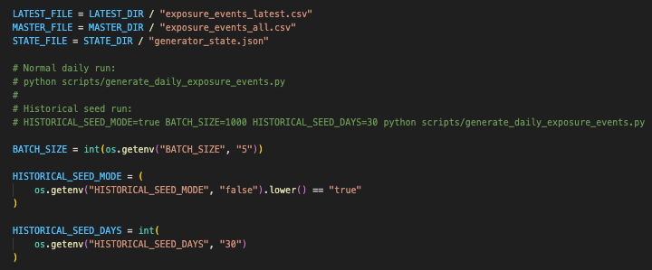
```

The project begins with a Python script:

```text
scripts/generate_daily_exposure_events.py
```

The script creates artificial insurance quote/exposure events. It writes:

```text
source_data/latest/exposure_events_latest.csv
source_data/master/exposure_events_all.csv
source_data/state/generator_state.json
```

The latest file is the file that ADF reads. The master file is a local generated history. The state file keeps quote IDs and run numbers consistent.

The generator supports a historical seed dataset:

```bash
BATCH_SIZE=1000 BACKFILL_DAYS=90 python scripts/generate_daily_exposure_events.py
```

This makes the forecasting and ML sections more meaningful.

---

## 4. GitHub as the raw file source

Add screenshot:

```markdown
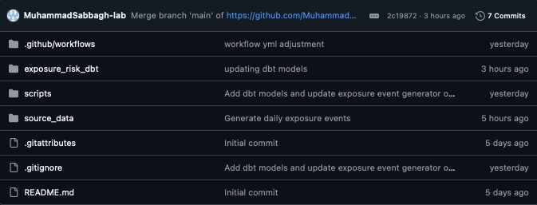
```

GitHub stores the project code and the latest generated CSV.

ADF reads from the GitHub raw file URL:

```text
https://raw.githubusercontent.com/<username>/global_exposure_risk_project/main/source_data/latest/exposure_events_latest.csv
```

This lets the project simulate an external source file that updates over time.

---

## 5. Optional GitHub Actions automation

Add screenshot:

```markdown
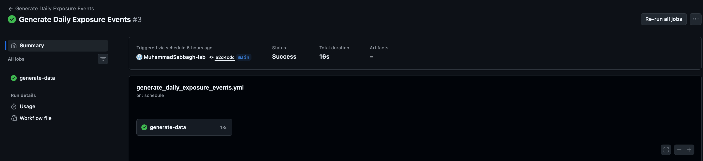
```

The optional GitHub Actions workflow can run the generator on a schedule and commit the generated files back into the repo.

This supports a simple automated data generation pattern:

```text
GitHub Actions → Python generator → updated latest CSV → ADF ingestion
```

---

## 6. ADF raw ingestion pipeline

Add screenshot:

```markdown
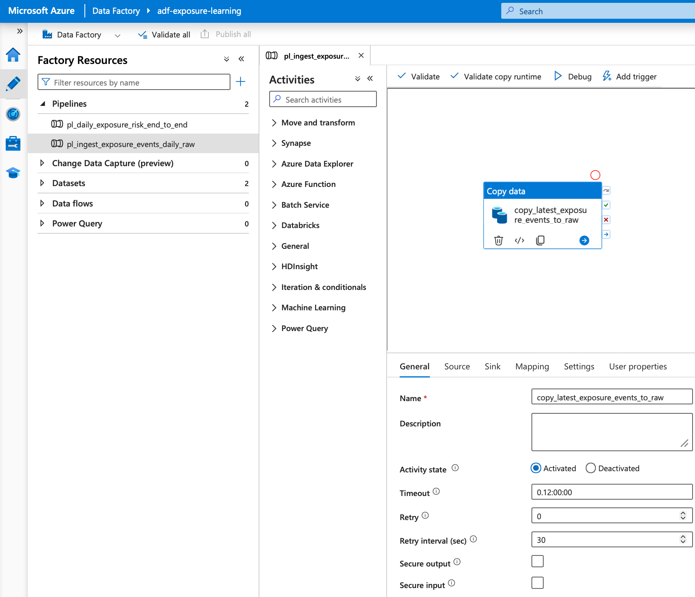
```

ADF copies the latest CSV from GitHub into ADLS Gen2.

The sink path is dynamic:

```text
raw/exposure/events/ingestion_date=YYYY-MM-DD/exposure_events_YYYYMMDD_HHMMSS.csv
```

This means each run creates a new raw file instead of overwriting the previous one.

---

## 7. ADLS raw data lake structure

Add screenshot:

```markdown
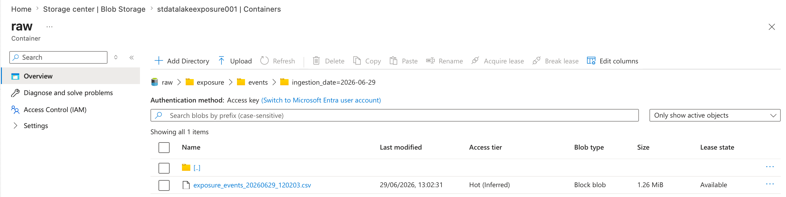
```

ADLS stores every raw batch historically.

Example structure:

```text
raw/
└── exposure/
    └── events/
        ├── ingestion_date=2026-06-28/
        ├── ingestion_date=2026-06-29/
        └── ingestion_date=2026-06-30/
```

This demonstrates a proper raw landing pattern.

---

## 8. Databricks engineering notebook

Add screenshot:

```markdown
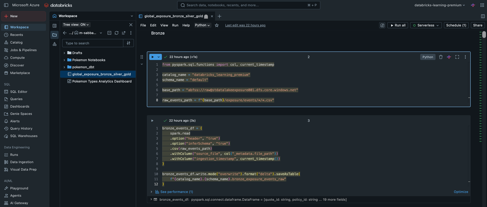
```

The Databricks notebook reads all historical raw files from ADLS and creates the core engineering tables.

Notebook:

```text
global_exposure_bronze_silver_gold
```

Main outputs:

- `bronze_exposure_events_raw`
- `silver_exposure_events_cleaned`
- `silver_daily_exposure_summary`
- `silver_ab_pricing_summary`
- `silver_risk_forecast`
- `silver_bind_probability_predictions`
- `silver_ml_model_metrics`
- `gold_exposure_events_engineering`
- `gold_daily_forecast_engineering`
- `gold_ab_pricing_engineering`
- `gold_bind_probability_predictions_engineering`
- `gold_ml_model_metrics_engineering`

---

## 9. Bronze layer

Bronze stores the raw structured files from ADLS as a Delta table.

Key purpose:

- read all raw CSV batches
- add source file metadata
- add ingestion timestamp
- preserve the raw source shape

Example code area to show:

```python
spark.read.option("header", "true").csv(raw_events_path)
```

---

## 10. Silver layer

Silver cleans and enriches the data.

Key transformations:

- lower-case and strip column names
- convert numeric fields
- convert date fields
- clean text fields
- remove bad rows
- deduplicate by quote ID
- create hazard level and risk category
- calculate risk weight
- calculate risk-weighted value
- calculate premium rate
- calculate expected loss ratio
- create bound status
- create event month

This section is important because it shows practical Python/Pandas cleaning work.

---

## 11. Forecasting table

Add screenshot:

```markdown
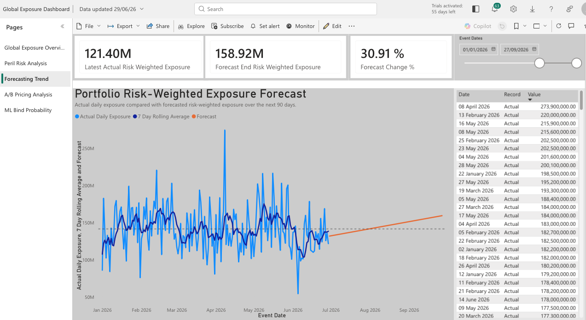
```

The forecast table uses a simple linear trend over historical daily risk-weighted exposure and extends it 90 days forward.

This is forecasting-style analysis, not the ML model.

The output supports the Power BI Actual vs Forecast page.

---

## 12. A/B pricing summary

Add screenshot:

```markdown
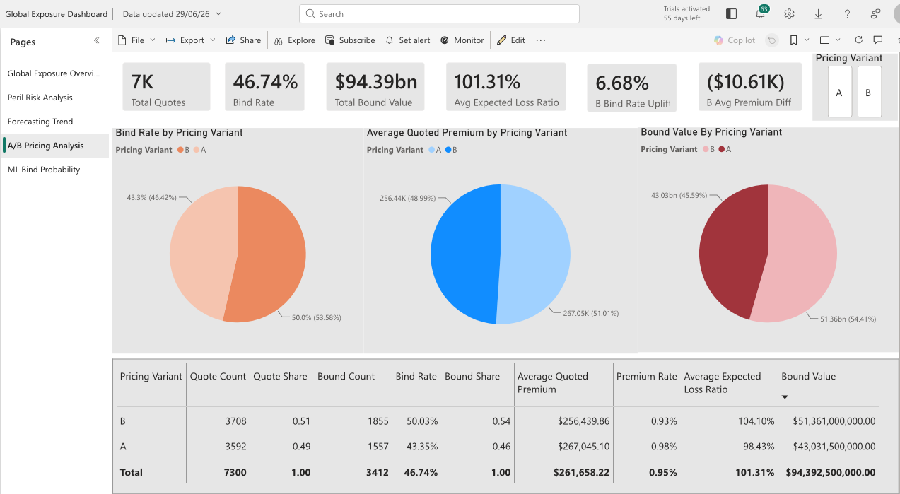
```

The A/B pricing logic compares pricing variants A and B.

Key measures:

- quote count
- bound count
- bind rate
- average quoted premium
- average premium rate
- average expected loss ratio
- total quoted value
- bound value

Important note:

```text
A and B bind rates are separate conversion rates.
They do not need to add up to 100%.
```

---

## 13. Machine learning bind probability model

Add screenshot:

```markdown
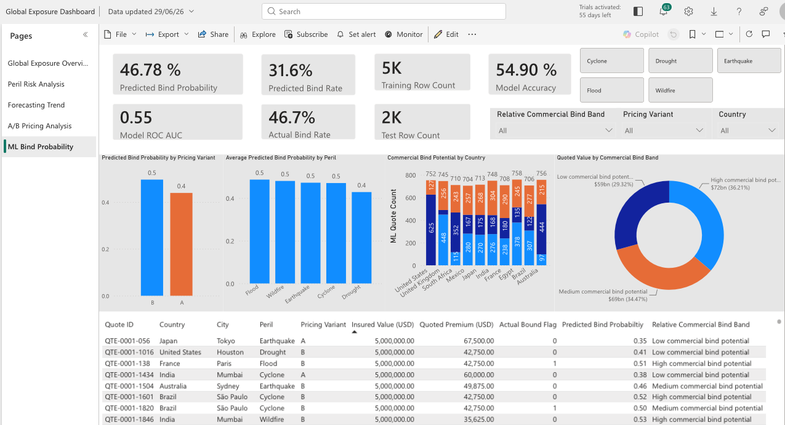
```

The ML model predicts whether a quote is likely to bind.

Model:

```text
Logistic Regression
```

Target:

```text
bound_flag
```

Output:

```text
predicted_bind_probability
```

The model uses both categorical and numeric features, including country, region, peril, asset type, pricing variant, hazard score, insured value, quoted premium and expected loss ratio.

The model writes predictions and metrics back into Databricks.

---

## 14. Databricks tables

Add screenshot:

```markdown
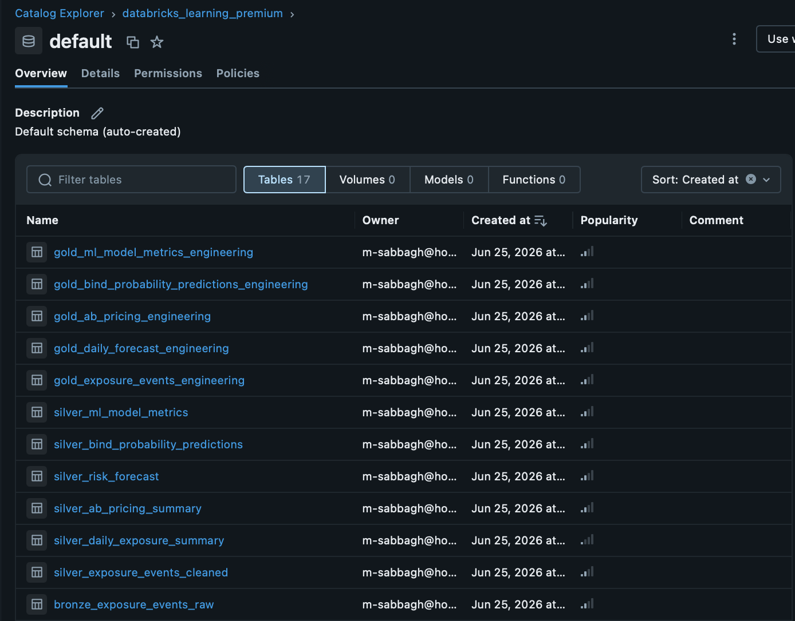
```

This screenshot should show the Bronze, Silver and Gold tables in Unity Catalog.

This is one of the most important screenshots because it proves the medallion architecture exists in Databricks.

---

## 15. dbt analytics modelling

Add screenshot:

```markdown
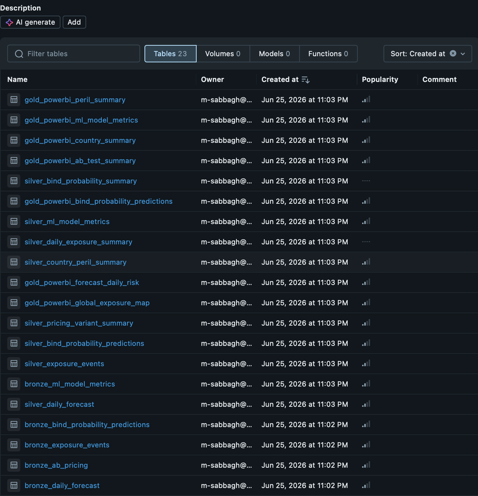
```

dbt sits on top of the Databricks Gold engineering tables and creates BI-ready models.

Final Power BI models:

- `gold_powerbi_global_exposure_map`
- `gold_powerbi_country_summary`
- `gold_powerbi_peril_summary`
- `gold_powerbi_forecast_daily_risk`
- `gold_powerbi_ab_test_summary`
- `gold_powerbi_bind_probability_predictions`
- `gold_powerbi_ml_model_metrics`

dbt tests are included in `schema.yml`.

---

## 16. ADF end-to-end orchestration

Add screenshot:

```markdown
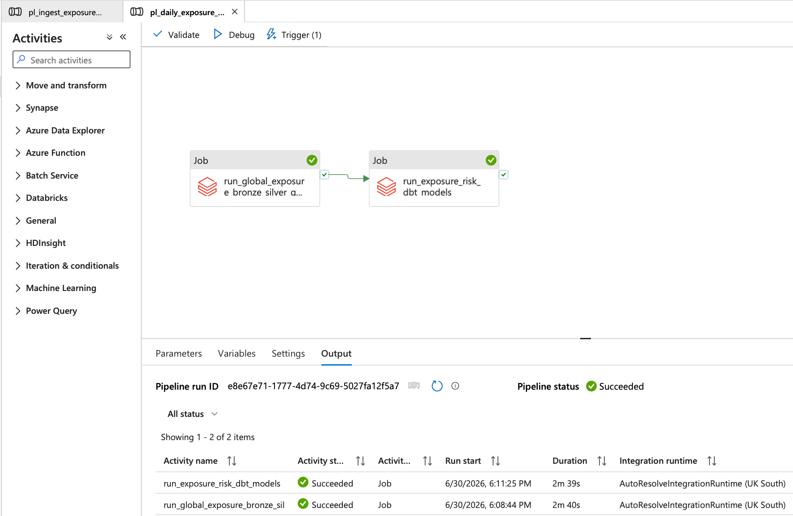
```

The final ADF pipeline runs the full process:

```text
raw ingestion pipeline
→ Databricks engineering job
→ Databricks dbt job
```

This demonstrates orchestration rather than isolated scripts.

---

## 17. Power BI dashboard

The Power BI report has five pages.

### Page 1 — Global Exposure Overview

Add screenshot:

```markdown
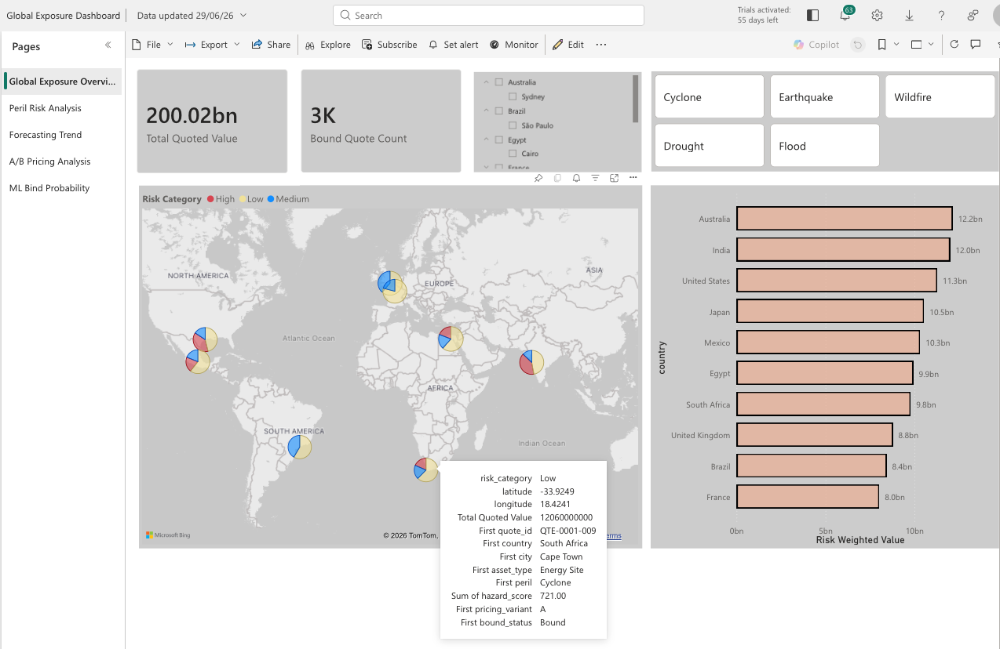
```

Shows:

- global exposure map
- total quoted value
- total risk-weighted value
- quote count
- bound quote count
- risk by country
- slicers

### Page 2 — Peril Risk Analysis

Add screenshot:

```markdown
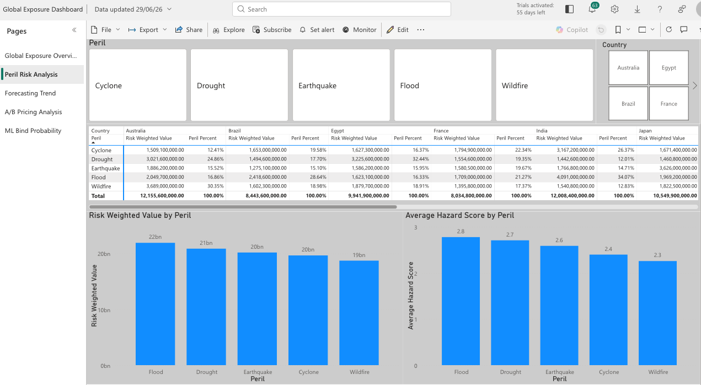
```

Shows:

- risk-weighted value by peril
- average hazard score by peril
- country/peril matrix
- peril slicer

### Page 3 — Forecasting Trend

Add screenshot:

```markdown

```

Shows:

- actual vs forecast risk-weighted exposure
- 90-day forecast
- explanation that the forecast is simple trend logic

### Page 4 — A/B Pricing Analysis

Add screenshot:

```markdown

```

Shows:

- bind rate by pricing variant
- average quoted premium by variant
- bound value by variant
- A/B summary table

### Page 5 — ML Bind Probability

Add screenshot:

```markdown

```

Shows:

- average predicted bind probability by peril
- average predicted bind probability by pricing variant
- relative commercial bind bands
- high-value low-probability quotes
- accuracy and ROC AUC cards

---

## 18. What this project proves

This project demonstrates:

- Python scripting
- generated data source creation
- Azure Data Factory ingestion
- ADLS Gen2 raw storage
- Databricks medallion architecture
- PySpark and Pandas transformations
- SQL Gold table creation
- scikit-learn machine learning
- dbt analytics modelling
- dbt tests
- Power BI dashboarding
- DAX measures and calculated columns
- ADF orchestration
- insurance-style analytics thinking

---

## 19. Interview explanation

I built an end-to-end Azure data engineering project that simulates an evolving global insurance exposure portfolio.

A Python generator creates artificial quote and exposure records. Azure Data Factory ingests the latest generated batch from GitHub and stores each run as a separate timestamped file in Azure Data Lake Storage Gen2. Databricks reads the raw files and processes them through Bronze, Silver and Gold layers. In Silver, I used Python and Pandas to clean the data, calculate risk metrics, create A/B pricing summaries, build a simple 90-day forecast and train a logistic regression model to predict quote bind probability.

On top of the Databricks Gold tables, I used dbt to create tested, Power BI-ready analytics models. The final Power BI dashboard shows global exposure, peril risk, actual vs forecast exposure, pricing variant performance and ML bind probability insights. The full process is orchestrated using Azure Data Factory.
